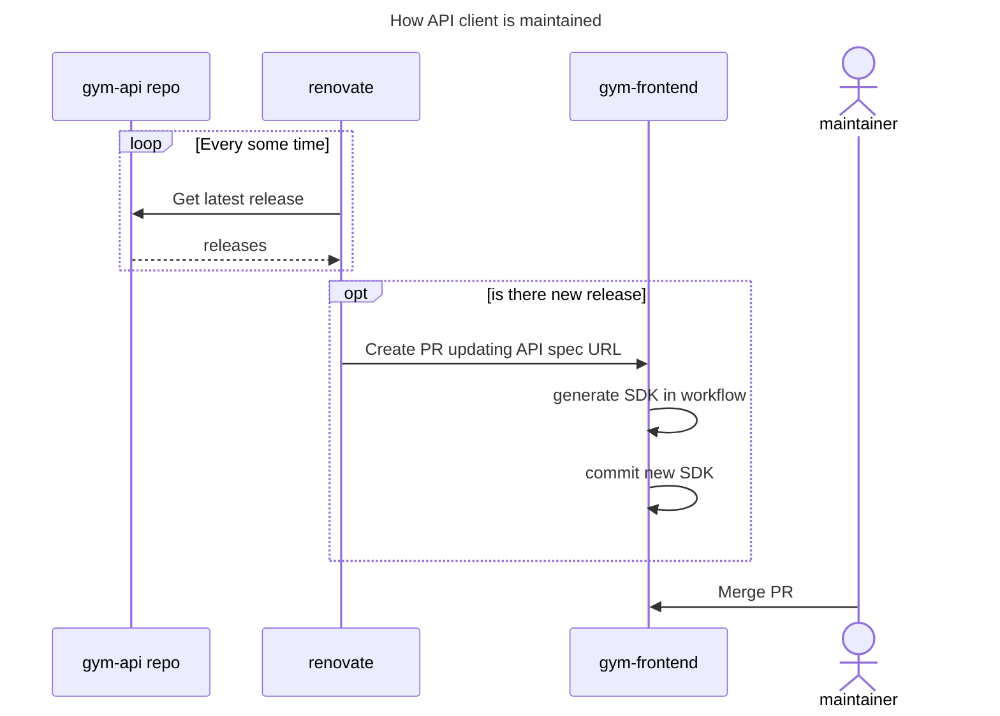

# Gym Frontend 🏋️

## Running

To run the project, install the dependencies:

```bash
npm i
```

Then, to start the application:

```bash
npm start
```

Or run in the development mode:

```bash
npm run dev
```
## Backend 

https://github.com/rafal11ck/gym-api

### How API client is maintained

